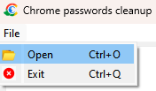

# Description
This program helps to clean up your passwords by removing not working web-sites in Chrome web browser.
# Usage
1. Open Chrome browser. 
2. Go to the **Settings --> Autofill --> Password Manager** 
([chrome://settings/passwords](chrome://settings/passwords/)) 
3. Navigate to the section **Saved Passwords** and click on the three dots on the right. 

Then click **Export passwords**.

Confirm by clicking **Export passwords** one more time.

And save your passwords CSV file to some location you want.
4. Open Chrome Passwords cleanuper and select file you have just saved. **File --> Open**.

5. Wait until the program check all websites from your passwords file. It can take up to 3 minutes. 
You can see the progress down below.

6. After program got answer from all web-sites from the file it will offer you to check manually some of them which gave
some incorrect answer.

Click on them to open in browser and mark not working ones.

7. The program will save new cleanuped file in the same directory of input file with the _new__ prefix.
8. Go back to Chrome, open **Settings --> Privacy and security --> Clear browsing data**
([chrome://settings/clearBrowserData](chrome://settings/clearBrowserData)) and mark **Passwords
and other sign-in data**.

9. Open again **Settings --> Autofill --> Password Manager** 
([chrome://settings/passwords](chrome://settings/passwords/))

Navigate to the section **Saved Passwords** and click on the three dots on the right.

Then click **Import passwords**.
 

10. You're great! Now your passwords don't contain not working web-sites anymore.